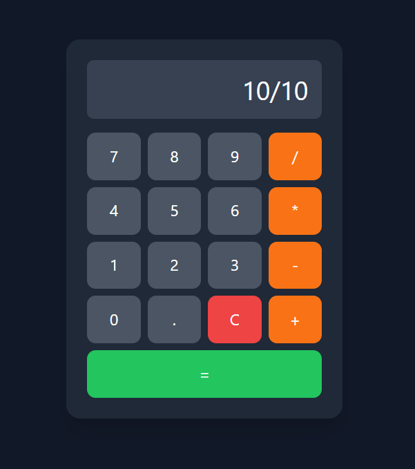

# 🧮 Calculadora Web com Python

Uma calculadora web simples desenvolvida utilizando **Python**, **Flask**, **HTML**, **JavaScript** e **TailwindCSS**.

O projeto foi criado com o objetivo de praticar integração entre backend em Python e interface web moderna.

---

## 🚀 Tecnologias utilizadas

- Python
- Flask
- HTML5
- JavaScript
- TailwindCSS

---

## ⚙️ Como executar o projeto

### 1️⃣ Clonar o repositório https://github.com/Jitterkkk/calculadora/

### 2️⃣ Entrar na pasta do projeto

### 3️⃣ Instalar as dependências

### 4️⃣ Executar o servidor

### 5️⃣ Abrir no navegador

---

## ✨ Funcionalidades

- Operações básicas:
  - Adição
  - Subtração
  - Multiplicação
  - Divisão
- Botão de limpar (`C`)
- Interface moderna utilizando TailwindCSS
- Layout responsivo

---

## 🎯 Objetivo do projeto

Este projeto foi desenvolvido para fins de **estudo e prática**, explorando:

- Integração entre backend e frontend
- Uso do framework Flask
- Estilização com TailwindCSS
- Manipulação de eventos com JavaScript

---

## 📸 Preview

Interface de calculadora moderna com botões interativos e display digital.

---

## 📄 Licença

Este projeto está sob a licença MIT.

## Preview

